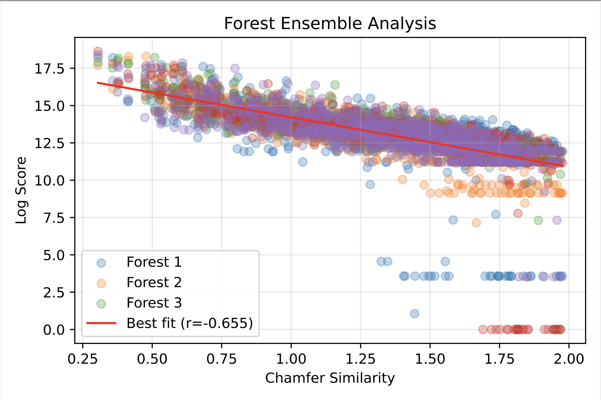

# Recursive LSH Forest for Chamfer Distance Approximation

(TODO - need to remove files that were left from initial exploration of our project)

This project implements a recursive Locality-Sensitive Hashing (LSH) forest approach to efficiently approximate the chamfer distance for multivector retrieval. The implementation provides a scalable solution for finding similar documents in high-dimensional vector spaces while maintaining accuracy and high recall.

## Depth-Weighted Chamfer Approximation Algorithm

Our core result is a depth-weighted scoring algorithm that leverages the probabilistic similarity inherent in node collisions within LSH forests. The algorithm takes advantage of the exponential decay in collision probability as a function of node depth, where vectors that collide deeper in the lsh forest trees are likely to be more similar.



Traditional chamfer distance computation requires comparing each query vector against every vector in every document, resulting in O(n²qd) complexity. While LSH forests reduce this to O(nq) by creating a separate forest for each document, our depth-weighted algorithm eliminates the linear dependence on the number of documents entirely, achieving O(q log n) complexity where q is the number of query vectors and n is the total number of vectors across all documents.

## Motivation

Traditional chamfer distance computation between sets of vectors has a quadratic complexity O(n²qd), making it computationally expensive for large-scale applications. Our recursive LSH forest implementation addresses this challenge by:

1. Providing an efficient approximation of chamfer distance with O(q log n) complexity
2. Reducing computational complexity through hierarchical partitioning
3. Supporting both single-document and multi-document retrieval
4. Maintaining accuracy through configurable parameters
5. Achieving high recall (>90%) and strong correlation (>0.8) with exact chamfer distance

## Computational Complexity

The implementation offers three main approaches with different complexity characteristics:

### Direct Chamfer Distance
- Requires comparing each query vector against every vector in every document
- O(n²qd) complexity, where:
  - n is the number of vectors per document
  - q is the number of query vectors
  - d is the vector dimension
- Best for small datasets or when exact distances are required

### Simple LSH Forest
- Requires creating a separate forest for each document
- O(nlog(n)qd) complexity, where:
  - n is the number of documents
  - q is the number of query vectors
  - d is the vector dimension

### Our Depth-Weighted LSH Forest

The implementation below represents a significant improvement over previous approaches: we eliminate the dependence on vector dimensions (d) entirely and reduce the dependence on the number of documents from nlogn to soley logarithmic. 

- O(q log n) complexity, where:
  - q is the number of query vectors
  - n is the total number of vectors across all documents


## Implementation Details

### Theoretical Foundation

For two normalized vectors x, y ∈ S^(d-1), using random hyperplane LSH (SimHash), the probability of collision at depth ℓ follows an exponential decay:

Pr[collision at depth ℓ] ≈ e^(-λr²ℓ)

where r = |x-y|. This exponential decay indicates that collisions at deeper levels strongly indicate greater similarity.

### Algorithm Components

1. **Depth-Weighted Scoring**
   - Each node maintains a count dictionary tracking vectors reaching that node
   - Root node contains all vectors (count = 1)
   - Leaf nodes have sparse dictionaries with non-zero counts for reaching vectors

2. **Weight Functions**
   Three families of depth-dependent weight functions:
   - Logistic: w_log(ℓ) = 1/(1 + e^(α(ℓ-k)))
   - Linear: w_lin(ℓ) = (L-ℓ + 1)/(L + 1)
   - Exponential: w_exp(ℓ) = γ^ℓ

3. **Query Process**
   - Traverse path from root to leaf for each query vector
   - Recursively aggregate scores when ascending back to root
   - Initialize score with leaf node counts weighted by w(D)
   - Calculate unique counts at each level
   - Average scores from multiple trees for final approximation

### Runtime Analysis

The algorithm achieves O(|Q|T log(NP̄)) complexity, where:
- |Q| is the number of query vectors
- T is the number of trees
- N is the number of documents
- P̄ is the average vectors per document

This represents a significant improvement over the classic O(|Q|NP̄) Chamfer computation.

### Key Components

1. **Node Class**
   - Binary tree node implementation
   - Stores vector IDs and hash functions
   - Maintains parent-child relationships
   - Tracks split attempts and depth

2. **RecursiveLSHForest Class**
   - Manages multiple LSH trees
   - Handles forest construction and queries
   - Configurable parameters for optimization
   - Supports both exact and approximate queries

3. **MultiDocLSHForest Class**
   - Extends basic LSH forest for multi-document scenarios
   - Efficient handling of document-specific queries
   - Optimized for batch processing

### Configuration Parameters

- `l`: Number of trees in the forest
- `k`: Number of pivots per internal node
- `km`: Maximum tree depth
- `max_hash_attempts`: Maximum attempts to find splitting hash function
- `max_split_ratio`: Maximum allowed ratio between split group sizes

## Quick Start

1. **Clone the repository and install requirements:**
```bash
git clone <repo-url>
cd recursive-lsh-forest
pip install -r requirements.txt
```

2. **Basic Usage Example:**
```python
from shared.lsh_forest import LSHForest, MultiDocLSHForest, RandomHyperplaneLSH
from shared.utils import build_multidoc_lsh, build_simple_lsh

# Initialize LSH family
lsh_family = RandomHyperplaneLSH(dim=128)

# Build a simple LSH forest
forest = build_simple_lsh(vectors, l=10, k=4, km=64)

# Query the forest
results = forest.query(query_vector, m=5)  # Get 5 nearest neighbors
```

## Performance Analysis

### Query Performance
- Majority of time spent on forest construction
- Query operations are relatively fast
- Performance scales well with dataset size
- Configurable trade-off between accuracy and speed

### Memory Usage
- Linear scaling with number of vectors
- Managble overhead for tree structure
- Optimized for large-scale datasets

## Future Work

1. **Optimization Opportunities**
   - Parallel forest construction
   - Dynamic parameter tuning
   - Improved hash function selection

2. **Feature Enhancements**
   - Support for dynamic updates
   - Additional distance metrics
   - Batch processing optimizations

3. **Integration Possibilities**
   - Distributed computing support
   - GPU acceleration
   - Integration with existing vector databases

## References

1. Bawa, M., et al. (2005). "LSH Forest: Self-Tuning Indexes for Similarity Search." WWW '05.
2. Datar, M., et al. (2004). "Locality-Sensitive Hashing Scheme Based on p-Stable Distributions." SoCG '04.
3. Andoni, A., & Indyk, P. (2008). "Near-Optimal Hashing Algorithms for Approximate Nearest Neighbor in High Dimensions." Communications of the ACM. 